##  Padlock (Rev)

This is the first and easy reverse engineering challenge, running the [file](_files/padlock) we have

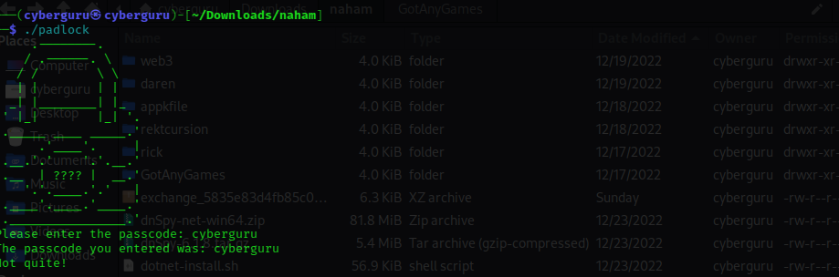

we could see that its asking for an input passcode, lets try decompiling it with binja we have the following disassembly;

commented assembly:

```
main:
00001538  f30f1efa           nop     edx, edi
0000153c  55                 push    rbp {__saved_rbp}
0000153d  4889e5             mov     rbp, rsp {__saved_rbp}
00001540  4883ec40           sub     rsp, 0x40
00001544  897dcc             mov     dword [rbp-0x34 {var_3c}], edi
00001547  488975c0           mov     qword [rbp-0x40 {var_48}], rsi
0000154b  64488b0425280000…mov     rax, qword [fs:0x28]
00001554  488945f8           mov     qword [rbp-0x8 {var_10}], rax
00001558  31c0               xor     eax, eax  {0x0}
0000155a  b93f000000         mov     ecx, 0x3f
0000155f  ba3f000000         mov     edx, 0x3f
00001564  be3f000000         mov     esi, 0x3f
00001569  bf3f000000         mov     edi, 0x3f
0000156e  e896fcffff         call    print_lock ; <-- print lock output
00001573  488d05930b0000     lea     rax, [rel data_210d]  {"Please enter the passcode: "} ; <-- ask for input text
0000157a  4889c7             mov     rdi, rax  {data_210d, "Please enter the passcode: "}
0000157d  b800000000         mov     eax, 0x0
00001582  e879fbffff         call    printf; <--- sent to stdout with printf
00001587  488b05822a0000     mov     rax, qword [rel stdin]
0000158e  488d55d0           lea     rdx, [rbp-0x30 {var_38}]
00001592  488d0d900b0000     lea     rcx, [rel data_2129]
00001599  4889ce             mov     rsi, rcx  {data_2129}
0000159c  4889c7             mov     rdi, rax
0000159f  b800000000         mov     eax, 0x0
000015a4  e817fbffff         call    __isoc99_fscanf ; <---input collected and stored
000015a9  488d45d0           lea     rax, [rbp-0x30 {var_38}]
000015ad  4889c6             mov     rsi, rax {var_38}
000015b0  488d05790b0000     lea     rax, [rel data_2130]  {"The passcode you entered was: %s…"}
000015b7  4889c7             mov     rdi, rax  {data_2130, "The passcode you entered was: %s…"}
000015ba  b800000000         mov     eax, 0x0
000015bf  e83cfbffff         call    printf ; <-- give back our input 
000015c4  488d45d0           lea     rax, [rbp-0x30 {var_38}]
000015c8  ba65000000         mov     edx, 0x65 ; <-- load 'e' into edx>
000015cd  be33000000         mov     esi, 0x33 ; <-- load '3' into esi>
000015d2  4889c7             mov     rdi, rax {var_38} ; <-- load our input into rdi>
000015d5  e8f2feffff         call    replace; <-- call some replace function to replace '3' with 'e' in the input
000015da  488d45d0           lea     rax, [rbp-0x30 {var_38}]
000015de  ba20000000         mov     edx, 0x20
000015e3  be5f000000         mov     esi, 0x5f
000015e8  4889c7             mov     rdi, rax {var_38}
000015eb  e8dcfeffff         call    replace
000015f0  488d45d0           lea     rax, [rbp-0x30 {var_38}]
000015f4  ba6f000000         mov     edx, 0x6f
000015f9  be30000000         mov     esi, 0x30
000015fe  4889c7             mov     rdi, rax {var_38}
00001601  e8c6feffff         call    replace
00001606  488d45d0           lea     rax, [rbp-0x30 {var_38}]
0000160a  ba61000000         mov     edx, 0x61
0000160f  be34000000         mov     esi, 0x34
00001614  4889c7             mov     rdi, rax {var_38}
00001617  e8b0feffff         call    replace
0000161c  488d45d0           lea     rax, [rbp-0x30 {var_38}]
00001620  4889c7             mov     rdi, rax {var_38}
00001623  e8b8faffff         call    strlen ; <-- check the procesed input len>
00001628  4883f826           cmp     rax, 0x26 ;  <-- compare with size of 38 >
0000162c  0f8580000000       jne     0x16b2
```

As we could see from the main function, our input is collected from stdin and sent as arguments to replace function then, the replace function replaces any leet variables with their normal alphabet character such as '3' with 'e', '4' with 'a', '0' with 'o' and so on after that the length of our input is compared with 0x26 {that's 38 in decimal}.

```
00001632  488d45d0           lea     rax, [rbp-0x30 {var_38}]
00001636  4889c6             mov     rsi, rax {var_38}
00001639  488d05180b0000     lea     rax, [rel data_2158]  {"master locks arent vry strong ar…"}
00001640  4889c7             mov     rdi, rax  {data_2158, "master locks arent vry strong ar…"}
00001643  e8c8faffff         call    strcmp
00001648  85c0               test    eax, eax
0000164a  757a               jne     0x16c6
```

after that, it goes on to compare the processed input with the string "master locks arent vry strong are they"
to solve it we simply reverse the comparision string according to the assembly flow doing that we have the flag

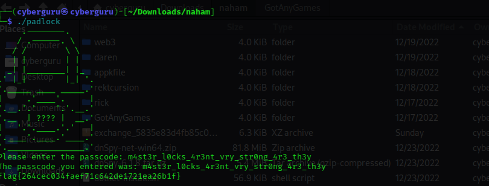

flag{264cec034faef71c642de1721ea26b1f}

## Rick (rev)

This is the second reverse engineering challenge we were given two files a stripped elf 64-bit binary [program](_files/program) and a encrypted [cipher](_files/ct.enc) text, running the program we have this output

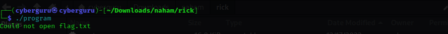

the program seems to be looking for a flag.txt file, lets decompile the program with ghidra

```

bool FUN_00101309(void)

{
  int iVar1;
  ulong uVar2;
  void *__ptr;
  bool bVar3;
  
  DAT_00104050 = fopen("input.txt","rb");
  bVar3 = DAT_00104050 != (FILE *)0x0;
  if (bVar3) {
    fseek(DAT_00104050,0,2);
    uVar2 = ftell(DAT_00104050);
    fseek(DAT_00104050,0,0);
    __ptr = malloc((long)(int)uVar2);
    fread(__ptr,(long)(int)uVar2,1,DAT_00104050);
    fclose(DAT_00104050);
    iVar1 = FUN_0010144b(__ptr,uVar2 & 0xffffffff);
    DAT_00104020 = fopen("ct.enc","wb");
    fwrite(DAT_00104028,(long)iVar1,1,DAT_00104020);
    fclose(DAT_00104020);
  }
  else {
    puts("Could not open flag.txt\n");
  }
  return bVar3;
}

```

analyzing the program we see that it opens an "input.txt" file and pass the content to `FUN_0010144b` then writes the output of the function to another file called "ct.enc", if the "input.txt" file does not exist it prints out "could not open flag.txt" which is exactly our output in the first picture above

lests see the content of `FUN_0010144b` function

```

int FUN_0010144b(uchar *param_1,int param_2)

{
  long in_FS_OFFSET;
  int local_28;
  int local_24;
  EVP_CIPHER_CTX *local_20;
  EVP_CIPHER *local_18;
  long local_10;
  
  local_10 = *(long *)(in_FS_OFFSET + 0x28);
  local_28 = param_2;
  memset(&DAT_00104040,0,0x10);
  DAT_00104028 = (uchar *)malloc((long)param_2);
  local_20 = EVP_CIPHER_CTX_new();
  local_18 = EVP_aes_128_cbc();
  FUN_00101539();
  EVP_EncryptInit(local_20,local_18,&DAT_00104030,&DAT_00104040);
  EVP_EncryptUpdate(local_20,DAT_00104028,&local_28,param_1,param_2);
  EVP_EncryptFinal_ex(local_20,DAT_00104028 + local_28,&local_24);
  if (local_10 != *(long *)(in_FS_OFFSET + 0x28)) {
                    /* WARNING: Subroutine does not return */
    __stack_chk_fail();
  }
  return local_24 + local_28;
}

```

The function is an implementation of 128 AES_CBC cipher in c, which makes use of the EVP_CIPHER_CTX_new() library module,
as usuall with AES we need an IV and a kEY to encrypt a plaintext, analyzing the function we could see that the IV is a 16 byte of 0's and the KEY is calculated by a function called `FUN_00101539(void)` which is then stored in a pointer called &DAT_00104030.

analyzing the content of the function we have:

```
void FUN_00101539(void)

{
  uint local_10;
  int local_c;
  
  for (local_c = 0; local_c < 0x10; local_c = local_c + 1) {
    if (local_c == 0) {
      local_10 = 0x27e2;
    }
    else {
      local_10 = (local_10 + local_c) * 4 ^ 0x29fa;
    }
    (&DAT_00104030)[local_c] = (char)local_10;
  }
  return;
}

```

the function simply creates a key of size 16 byte and stores it in DAT_0014030, so all our parameters of IV and KEY is available we could reimplement thesame function in c++ and decrypt the cipher text. full code [here](_files/rick.cpp)

```

  int dec_func(unsigned char *ciphertext, int ciphertext_len, unsigned char *key, unsigned char *iv) {
  EVP_CIPHER_CTX *ctx;
  int len;
  int plaintext_len;
  unsigned char *plaintext;

  // Allocate and initialize a new cipher context
  ctx = EVP_CIPHER_CTX_new();

  // Initialize the context for a decryption operation using the
  // AES cipher in CBC mode with the given key and IV
  EVP_DecryptInit(ctx, EVP_aes_128_cbc(), key, iv);

  // Allocate a buffer to hold the plaintext
  plaintext = (unsigned char*)malloc(ciphertext_len);

  // Decrypt the ciphertext and store the resulting plaintext in the buffer
  EVP_DecryptUpdate(ctx, plaintext, &len, ciphertext, ciphertext_len);
  plaintext_len = len;

  // Finalize the decryption operation
  EVP_DecryptFinal_ex(ctx, plaintext + len, &len);
  plaintext_len += len;

  // Clean up the cipher context
  EVP_CIPHER_CTX_free(ctx);
  cout << plaintext;
  return plaintext_len;
}

<---snip--->
```

compiling the program with ` g++ rick.cpp -lcrypto -lssl ` and running it we have our flag as:

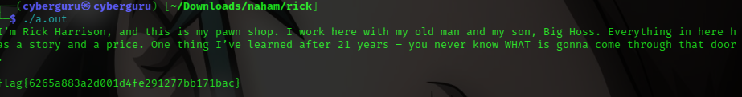


flag{6265a883a2d001d4fe291277bb171bac}

## Got Any Games? (Andriod)

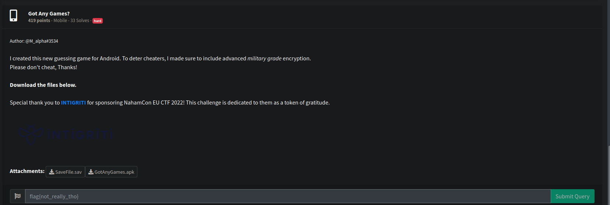

This an andriod challenge, two files where given in the task, a SaveFile.sav file and GotAnyGames.apk file, according to the hint it says its a guessing game for andriod, which implements an advanced militrary grade encryption to deter cheaters.

opening the SaveFile.sav file, we saw some giberrish texts, probably some encrypted stuff

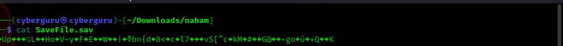

well its an andriod task time to use the apktool to decompile it, this are the content of the apk file

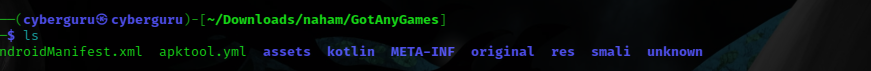

after decompiling it i converted the classes.dex file to classes.jar file using the dex2jar program


and finally we got our jar file we could load to java decompiler JD-GUI, i didn't bother installing the apkfile on an andriod emulator just went on too decompile it and started searching around talk about being cozzy xd :)

these our classes file loaded in jd-gui

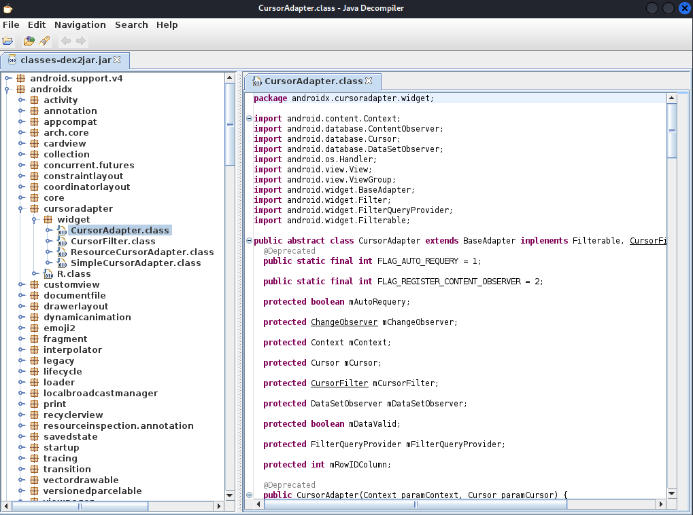

searching through and playing around, firsting i searached for was our the "SaveFile.sav" file was created, thereby narrowing my search to some class files, from the search bar i saw the string ".sav" was mentioned in three classes

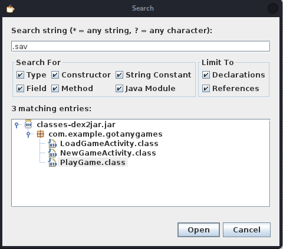

took each class one by one and analyze them, 

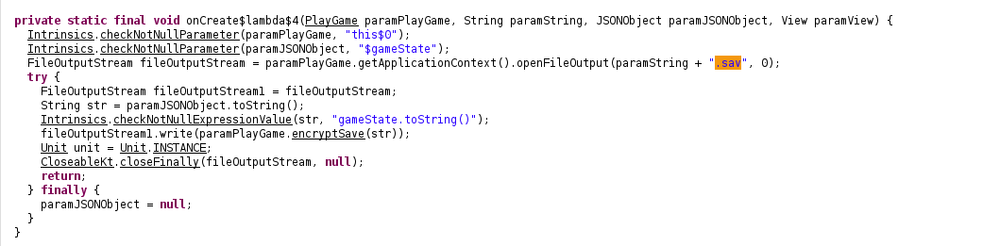

so basically the PLayGame.class file loads up a file with an extension of ".sav" to read the contents which is then used to initialize the gamestate used for playing the guessing game and also save the gamestate with same extension

```
private final byte[] encryptSave(String paramString) {
    Cipher cipher = Cipher.getInstance("AES/CBC/PKCS7Padding");
    cipher.init(1, new SecretKeySpec(this.k, 0, 32, "AES"));
    byte[] arrayOfByte1 = paramString.getBytes(Charsets.UTF_8);
    Intrinsics.checkNotNullExpressionValue(arrayOfByte1, "this as java.lang.String).getBytes(charset)");
    arrayOfByte1 = cipher.doFinal(arrayOfByte1);
    Mac mac = Mac.getInstance("HmacSHA256");
    mac.init(new SecretKeySpec(this.k, 0, 32, "HmacSHA256"));
    byte[] arrayOfByte3 = cipher.getIV();
    Intrinsics.checkNotNullExpressionValue(arrayOfByte3, "cipher.iv");
    Intrinsics.checkNotNullExpressionValue(arrayOfByte1, "encryptedData");
    arrayOfByte3 = mac.doFinal(ArraysKt.plus(arrayOfByte3, arrayOfByte1));
    byte[] arrayOfByte2 = cipher.getIV();
    Intrinsics.checkNotNullExpressionValue(arrayOfByte2, "cipher.iv");
    arrayOfByte1 = ArraysKt.plus(arrayOfByte2, arrayOfByte1);
    Intrinsics.checkNotNullExpressionValue(arrayOfByte3, "macValue");
    return ArraysKt.plus(arrayOfByte1, arrayOfByte3);
  }
```


analyzing further we could see a call was made to a function called `encryptSave` that encrypts the gameState content into a file using the AES/CBC/PKCS7Padding mode, which uses a 32 bit IV and a KEY.

Finding the IV and KEY

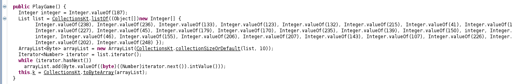

a specific function is responsible in generating the key, reimplementing this function in python we got the key to be

[238,236,133,123,132,215,41,111,93,8,227,45,179,170,235,139,150,187,160,231,187,46,155,206,207,143,107,226,131,54,202,248]

Finding the IV

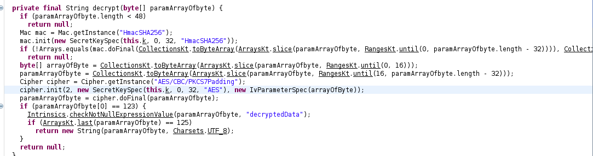

i realized that from the LoadGameActivity.class the class responsible for loading the gameState from the ".sav" file extension we could see that their is a function called String decrypt that uses the first 16 byte of the ".sav" file extension as our IV and the remainning as our cipher text this means that the IV and Cipher text was stored in the same file. 

with all this information we could easily write a script to decrypt the "SaveFile.sav" in python full file [here](scripts/sol_app.py)

```
from Crypto.Cipher import AES
values=[238,236,133,123,132,215,41,111,93,8,227,45,179,170,235,139,150,187,160,231,187,46,155,206,207,143,107,226,131,54,202,248]

key = bytearray(values)
with open('SaveFile.sav', 'rb') as f:
	cipher = f.read()
	
iv = cipher[:16]
cipher = cipher[16:]
xcipher = AES.new(key, AES.MODE_CBC, iv)
mess = xcipher.decrypt(cipher)
print(mess)

```
running it we got our flag

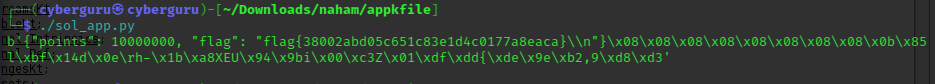

flag{38002abd05c651c83e1d4c0177a8eaca}


