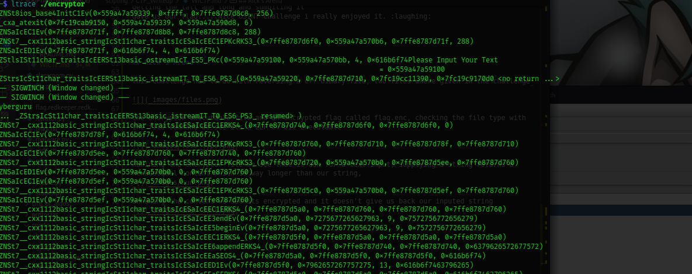
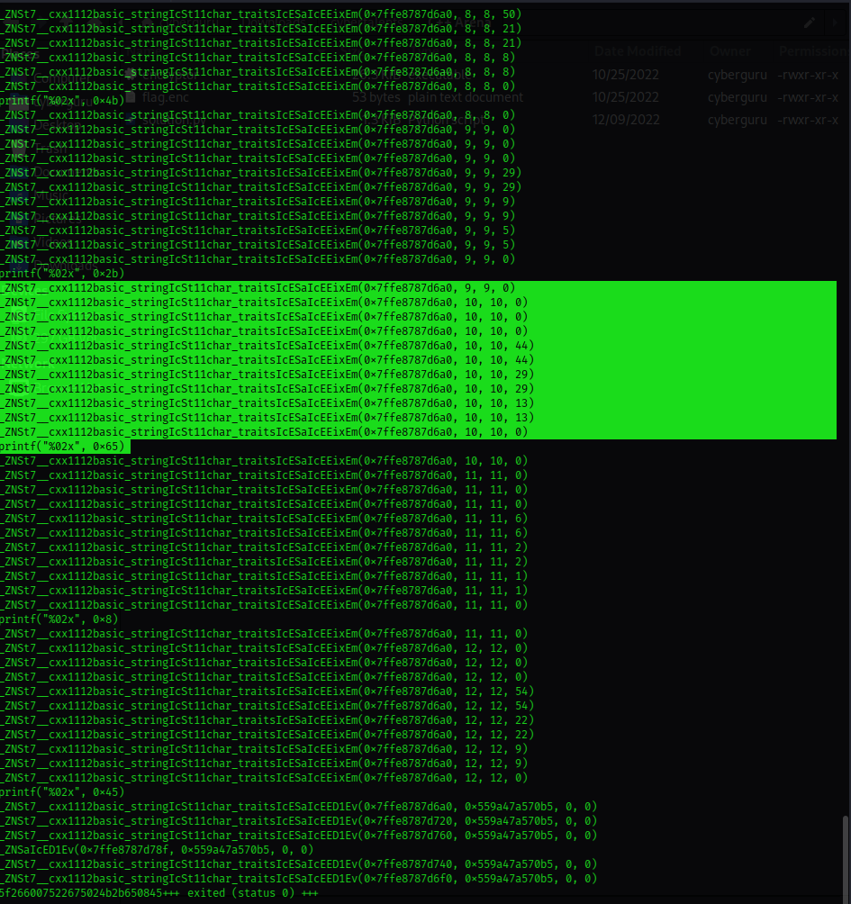

## The JUGGLER (Misc)
```
<?php
include 'secret.php';
$username='Administrator';
$obj=json_decode(file_get_contents('php://input'), true);

if (!empty($obj['username']) && !empty($obj['password'])){
if ($obj['username'] == $username && $obj['password'] = $password){
    echo "Access Granted!";
}
else {
    echo "Wrong password";
}
} else {echo "Empty Params";}
?>

```

This challenge requires us to review the given PHP code as it contains bugs, there are 5 test cases that it needs to pass before it could give us our flag.
 
 Analyzing the code we could see that challenge is trying to check the contestant's understanding of the commonly found vulnerabilities in PHP known as **PHP type Juggling** and how they could lead to authentication bypass vulnerability. you could read more of PHP type juggling [here](https://medium.com/swlh/php-type-juggling-vulnerabilities-3e28c4ed5c09)
  
 Now back to the challenge, for a user to be granted access the user must pass the verification with correct login credentials, the bug in this code is firstly a deserialization flaw, the user input is not correctly filtered, the second bug is the second block of if statement we could see that the comparison operator is using only double equal sign **"=="** if a user simply submits an integer input of 0 would successfully log in as admin, since this will evaluate to True, this is because the secret password would be converted to an integer and evaluate to true.

Changing the comparison operator from **"=="** to **"==="** correctly passes the check cases and throws our flag.


## Nimbus prime (OSINT)


An image was given, and the challenge was to find the location -the latitude and longitude of the place -


my first attempt was using [tinyeye](tinyeye.com) to do a reverse image search, but nothing came up.
Taking a close look at the pic we could see that it's like an airport or railway station cause of the people in the pic with luggage,
another thing to observe was the nimbus monument (all harry potter fans should know this :grinning: )).

i went on to google map to search for the nimbus monument, one that is specifically around a station of some sort

 

Well the results weren't that appealing to what I was looking for

my last attempt was using google lens, it brought up a result instantly


going to google maps and doing more search on the area I got the exact location


atlas my intuition was correct it was an airport station called "Humberto Delgado Airport" !!!
getting the latt and long and submitting it
gave us our flag.....Nice OSINT challenge i enjoyed it. :laughing:


## C++'s Arena

This challenge has to do with reversing a c++ binary file, two files were given in the challenge 


the encryptor executable file and an encrypted flag called flag.enc, checking the file type with the file command we see its an ELF 64-bit executable


Running the encryptor file we see that it ask for text input, supplying a string returns a hexadecimal content which is way longer than our string,


unhexing the content we see it encrypted and it doesn't give us back our input string


using ltrace to run the program again we have



we could see a lot of calls starting with _zNSt7 this proves to us that its a c++ compiled binary



examining the ltrace output we see a call to print function `printf("%02x", 0x2b)` that prints out the hex string right after some calls to some function named `_ZNSt7__cxx1112basic_stringIcSt11char_traitsIcESaIcEEixEm(0x7ffe8787d6a0, 11, 11, 0)`

opening the file in ghidra and examining the file from the entry to the main


the first rectangle shows us the output text that prompted us to input a text using `std::operator<< ` and stores it in in `local_98` using `std::operator>>` the content of our input is now passed to the function  `FUN_00102295` along with a string called "toka", analyzing the function we see that our input text is reversed and the toka string is appended on to our input and becomes "urugerbyctoka", the function now went on to split the text using even and odd index, that is each character of our combined string that falls into the even index are stored in a separate variable and same for the odd strings, then the even variable strings are shifted forward in 3 places using shift cipher and the odd variables where shifted backward in 3 places after this operation is done, the string is now appended back
according to the order of indexes, illustrating

combined_text = "urugrebyctoka"

even_index = "uurbcoa" after shifting becomes "xxuefrd"

odd_index = "rgeytk", after shifting becomes "odbvqh"

odd and even combined to "xoxdubevfqrhd"

confirming our analysis using gdb we have: 

- for the first operation where the string was reversed and toka added:


- the second operation where the odd indexes were shifted


- last operation where even and odd indexes were combined:


the content of this function is now returned to another function that performs some bitwise shifting on each string


* explanation of the function:
    the function loops through each character of the combined string and performs:
    
    - first, check if the iteration constant is `local_1c` is greater than zero, if it evaluates to true it xors the current index of the string with the last index of the string and if false continue's with the loop
  
    - shifts it consecutively by 1, 2, 3, and 8 respectively and xors the content with the shifted result
  
    - and then finally prints out the result using printf in hex format "%02X"

Now after understanding the program, it's time to reverse the operation of each function to get back our encrypted flag,
i wrote a script [(full script here)](scripts/solution.py) to perform just that

```
def zor(x, y):
    for i in range(1, 300):
        if ((i >> x) ^ i) == y:

            return i
            
def decode(hexx):
    hhex = []
    for i in range(1, len(hexx)//2 + 1):
        hhex.append(int(hexx[(2*i-2):(2*i)],16))


    v13 = [i for i in hhex]

    v14 = len(v13)
    for i in range(v14):

        for j in range(3,0,-1):
            v13[i] = zor(j, v13[i])
        if  i > 0 :
            
            v1 = hhex[i - 1]
            v2 = v13[i]
            v13[i] = v2 ^ v1
                

    #print(''.join([chr(i) for i in v13]))
    
    flag=''
    for i in range(len(v13)):
        if i & 1 == 0:
            flag += chr(v13[i] - 3)
        else:
            if v13[i] < 90:
                v =(v13[i] + 3) % 90 
                v += 64 if v < 65 else 0
                flag += chr(v)
            else:
                v =(v13[i] + 3) % 122
                v += 96 if v < 96 else 0
                flag += chr(v)

```

The script performs each operation in the reverse order keeping in mind some constraints while performing bitwise shift and XORing, now that our script is ready we now open the content of the `flag.enc`


coping the hex content and running it with our script we have

